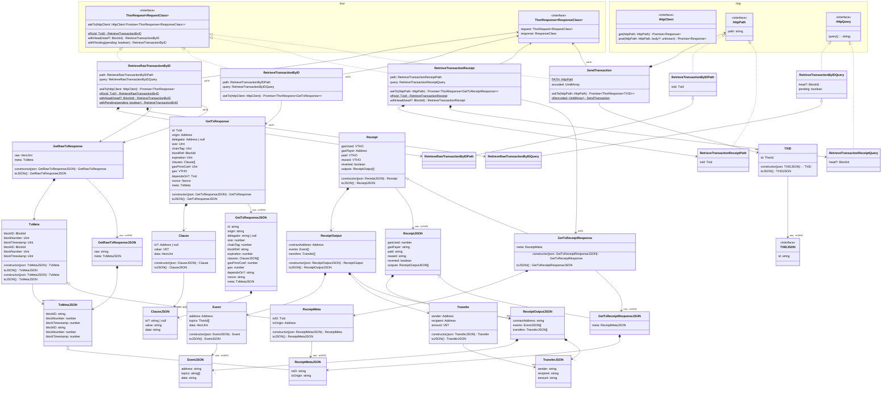

```mermaid
classDiagram
    namespace http {
        class HttpClient {
            <<interface>>
            get(httpPath: HttpPath) Promise~Response~
            post(httpPath: HttpPath, body?: unknown) Promise~Response~
        }
        class HttpPath {
            <<interface>>
            path: string
        }
        class HttpQuery {
            <<interface>>
            query(): string;
        }
    }
    namespace thor {
        class ThorRequest~RequestClass~ {
            <<interface>>
            askTo(httpClient: HttpClient Promise~ThorResponse~ResponseClass~~
            of(txId: TxId) RetrieveTransactionByID$
            withHead(head?: BlockId) RetrieveTransactionByID
            withPending(pending: boolean) RetrieveTransactionByID
        }
        class ThorResponse~ResponseClass~ {
            <<interface>>
            request: ThorRequest~RequestClass~
            response: ResponseClass
        }
    }
    class Clause {
        to?: Address | null
        value: VET
        data: HexUInt
        constructor(json: ClauseJSON) Clause
        toJSON() ClauseJSON
    }
    class ClauseJSON {
        to?: string | null
        value: string
        data: string
    }
    class Event {
        address: Address
        topics: ThorId[]
        data: HexUInt
        constructor(json: EventJSON) Event
        toJSON() EventJSON
    }
    class EventJSON {
        address: string
        topics: string[]
        data: string
    }
    class GetRawTxResponse {
        raw: HexUInt
        meta: TxMeta
        constructor(json: GetRawTxResponseJSON) GetRawTxResponse
        toJSON() GetRawTxResponseJSON
    }
    class GetRawTxResponseJSON {
        raw: string
        meta: TxMetaJSON
    }
    class GetTxReceiptResponse {
        meta: ReceiptMeta
        constructor(json: GetTxReceiptResponseJSON) GetTxReceiptResponse
        toJSON() GetTxReceiptResponseJSON
    }
    class GetTxReceiptResponseJSON {
        meta: ReceiptMetaJSON
    }
    class GetTxResponse {
        id: TxId
        origin: Address
        delegator: Address | null
        size: UInt
        chainTag: UInt
        blockRef: BlockId
        expiration: UInt
        clauses: Clause[]
        gasPriceCoef: UInt
        gas: VTHO
        dependsOn?: TxId
        nonce: Nonce
        meta: TxMeta
        constructor(json: GetTxResponseJSON) GetTxResponse
        toJSON() GetTxResponseJSON
    }
    class GetTxResponseJSON {
        id: string
        origin: string
        delegator: string | null
        size: number
        chainTag: number
        blockRef: string
        expiration: number
        clauses: ClauseJSON[]
        gasPriceCoef: number
        gas: number
        dependsOn?: string
        nonce: string
        meta: TxMetaJSON
    }
    class TxMeta {
        blockID: BlockId
        blockNumber: UInt
        blockTimestamp: UInt
        constructor(json: TxMetaJSON) TxMeta
        toJSON() TxMetaJSON
    }
    class TxMetaJSON {
        blockID: string
        blockNumber: number
        blockTimestamp: number
    }
    class Receipt {
        gasUsed: VTHO
        gasPayer: Address
        paid: VTHO
        reward: VTHO
        reverted: boolean
        outputs: ReceiptOutput[]
        constructor(json: ReceiptJSON) Receipt
        toJSON() ReceiptJSON
    }
    class ReceiptJSON {
        gasUsed: number
        gasPayer: string
        paid: string
        reward: string
        reverted: boolean
        outputs: ReceiptOutputJSON[]
    }
    class ReceiptMeta {
        txID: TxId
        txOrigin: Address
        constructor(json: ReceiptMetaJSON) ReceiptMeta
        toJSON() ReceiptMetaJSON
    }
    class ReceiptMetaJSON {
        txID: string
        txOrigin: string
    }
    class ReceiptOutput {
        contractAddress: Address
        events: Event[]
        transfers: Transfer[]
        constructor(json: ReceiptOutputJSON) ReceiptOutput
        toJSON() ReceiptOutputJSON
    }
    class ReceiptOutputJSON {
        contractAddress: string
        events: EventJSON[]
        transfers: TransferJSON[]
    }
    class RetrieveRawTransactionByID {
        path: RetrieveRawTransactionByIDPath
        query: RetrieveRawTransactionByIDQuery
        askTo(httpClient: HttpClient) Promise~ThorResponse~
        of(txId: TxId) RetrieveRawTransactionByID$
        withHead(head?: BlockId) RetrieveTransactionByID$
        withPending(pending: boolean) RetrieveTransactionByID$
    }
    class RetrieveTransactionByID {
        path: RetrieveTransactionByIDPath
        query: RetrieveTransactionByIDQuery
        askTo(httpClient: HttpClient) Promise~ThorRespons~GetTxResponse~~
    }
    class RetrieveTransactionByIDPath {
        txId: TxId
    }
    class RetrieveTransactionByIDQuery {
        head?: BlockId
        pending: boolean
    }
    class RetrieveTransactionReceipt {
        path: RetrieveTransactionReceiptPath
        query: RetrieveTransactionReceiptQuery
        askTo(httpPath: HttpPath) Promise~ThorResponse~GetTxReceiptResponse~~
        of(txId: TxId) RetrieveTransactionReceipt$
        withHead(head?: BlockId) RetrieveTransactionReceipt
    }
    class RetrieveTransactionReceiptPath {
        txId: TxId
    }
    class RetrieveTransactionReceiptQuery {
        head?: BlockId
    }
    class SendTransaction {
        PATH: HttpPath$
        encoded: Uint8Array
        askTo(httpPath: HttpPath) Promise~ThorResponse~TXID~~
        of(encoded: Uint8Array) SendTransaction$
    }
    class Transfer {
        sender: Address
        recipient: Address
        amount: VET
        constructor(json: TransferJSON) Transfer
        toJSON() TransferJSON
    }
    class TransferJSON {
        sender: string
        recipient: string
        amount: string
    }
    class TXID {
        id: ThorId
        constructor(json: TXIDJSON): TXID
        toJSON() TXIDJSON
    }
    class TXIDJSON {
        <<interface>>
        id: string
    }
    class TxMeta {
        blockID: BlockId
        blockNumber: UInt
        blockTimestamp: UInt
        constructor(json: TxMetaJSON) TxMeta
        toJSON() TxMetaJSON
    }
    class TxMetaJSON {
        blockID: string
        blockNumber: number
        blockTimestamp: number
    }
    Clause --> "new - toJSON" ClauseJSON
    Event --> "new - toJSON" EventJSON
    GetRawTxResponse *--> TxMeta
    GetRawTxResponse --> "new - toJSON" GetRawTxResponseJSON
    GetRawTxResponse <-- "askTo" RetrieveRawTransactionByID
    GetRawTxResponseJSON *--> TxMetaJSON
    GetTxReceiptResponse *--> ReceiptMeta
    GetTxReceiptResponse --> "new - toJSON" GetTxReceiptResponseJSON
    GetTxReceiptResponseJSON *--> ReceiptMetaJSON
    GetTxResponse *--> "*" Clause
    GetTxResponse --> "new - toJSON" GetTxResponseJSON
    GetTxResponseJSON *--> "*" ClauseJSON
    HttpPath <--* SendTransaction
    HttpPath <|.. RetrieveTransactionByIDPath
    HttpPath <|.. RetrieveTransactionReceiptPath
    HttpQuery <|.. RetrieveTransactionByIDQuery
    HttpQuery <|.. RetrieveTransactionReceiptQuery
    Receipt *--> "*" ReceiptOutput
    Receipt --> "new - toJSON" ReceiptJSON
    Receipt <|-- GetTxReceiptResponse
    ReceiptJSON *--> "*" ReceiptOutputJSON
    ReceiptJSON <|-- GetTxReceiptResponseJSON
    ReceiptMeta --> "new - toJSON" ReceiptMetaJSON
    ReceiptOutput *--> "*" Event
    ReceiptOutput *--> "*" Transfer
    ReceiptOutput --> "new - toJSON" ReceiptOutputJSON
    ReceiptOutputJSON *--> "*" EventJSON
    ReceiptOutputJSON *--> "*" TransferJSON
    RetrieveRawTransactionByID *--> RetrieveRawTransactionByIDPath
    RetrieveRawTransactionByID *--> RetrieveRawTransactionByIDQuery
    RetrieveRawTransactionByID --> "askTo" GetRawTxResponse
    RetrieveTransactionByID --> "askTo" GetTxResponse
    RetrieveTransactionByIDPath <|-- RetrieveRawTransactionByIDPath
    RetrieveTransactionByIDQuery <|-- RetrieveRawTransactionByIDQuery
    RetrieveTransactionReceipt *--> RetrieveTransactionReceiptPath
    RetrieveTransactionReceipt *--> RetrieveTransactionReceiptQuery
    RetrieveTransactionReceipt --> "askTo" GetTxReceiptResponse
    SendTransaction --> "askTo" TXID
    ThorRequest <|.. RetrieveRawTransactionByID
    ThorRequest <|.. RetrieveTransactionByID
    ThorRequest <|.. RetrieveTransactionReceipt
    ThorRequest <|.. SendTransaction
    ThorResponse <-- "askTo" RetrieveRawTransactionByID
    ThorResponse <-- "askTo" RetrieveTransactionByID
    ThorResponse <-- "askTo" RetrieveTransactionReceipt
    ThorResponse <-- "askTo" SendTransaction
    Transfer --> "new - toJSON" TransferJSON
    TXID --> "new - toJSON" TXIDJSON
    TxMeta --> "new - toJSON" TxMetaJSON
    TxMeta <|-- ReceiptMeta
    TxMetaJSON <|-- ReceiptMetaJSON
```
