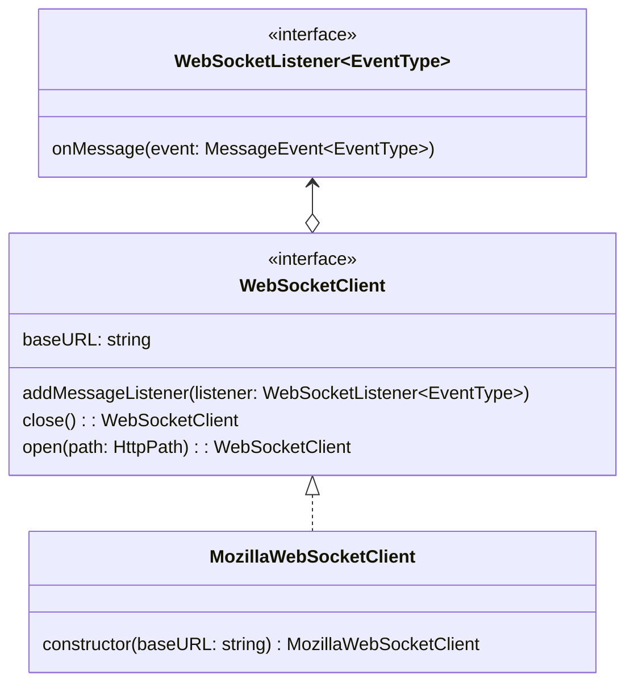

```mermaid
classDiagram
    class MozillaWebSocketClient {
        constructor(baseURL: string) MozillaWebSocketClient
    }
    class WebSocketClient {
        <<interface>>
        baseURL: string
        addMessageListener(listener: WebSocketListener~EventType~)
        close(): WebSocketClient
        open(path: HttpPath): WebSocketClient
    }
    class WebSocketListener~EventType~ {
        <<interface>>
        onMessage(event: MessageEvent~EventType~)
    }
    WebSocketClient <|.. MozillaWebSocketClient
    WebSocketListener <--o WebSocketClient
```
