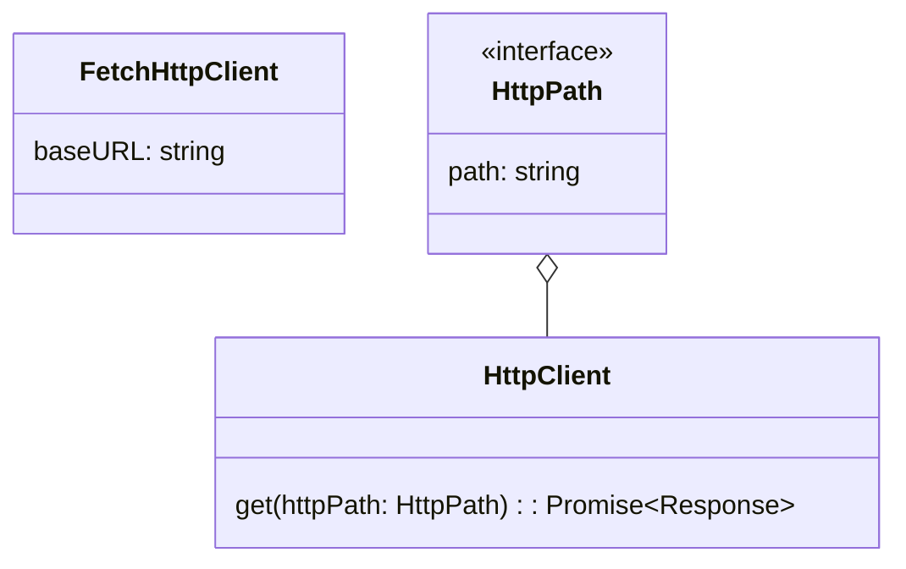

```mermaid
classDiagram
    class FetchHttpClient {
        baseURL: string
        
    }
    class HttpClient {
        get(httpPath: HttpPath): Promise~Response~
    }
    class HttpPath {
        <<interface>>
        path: string
    }
    HttpPath o-- HttpClient
```
