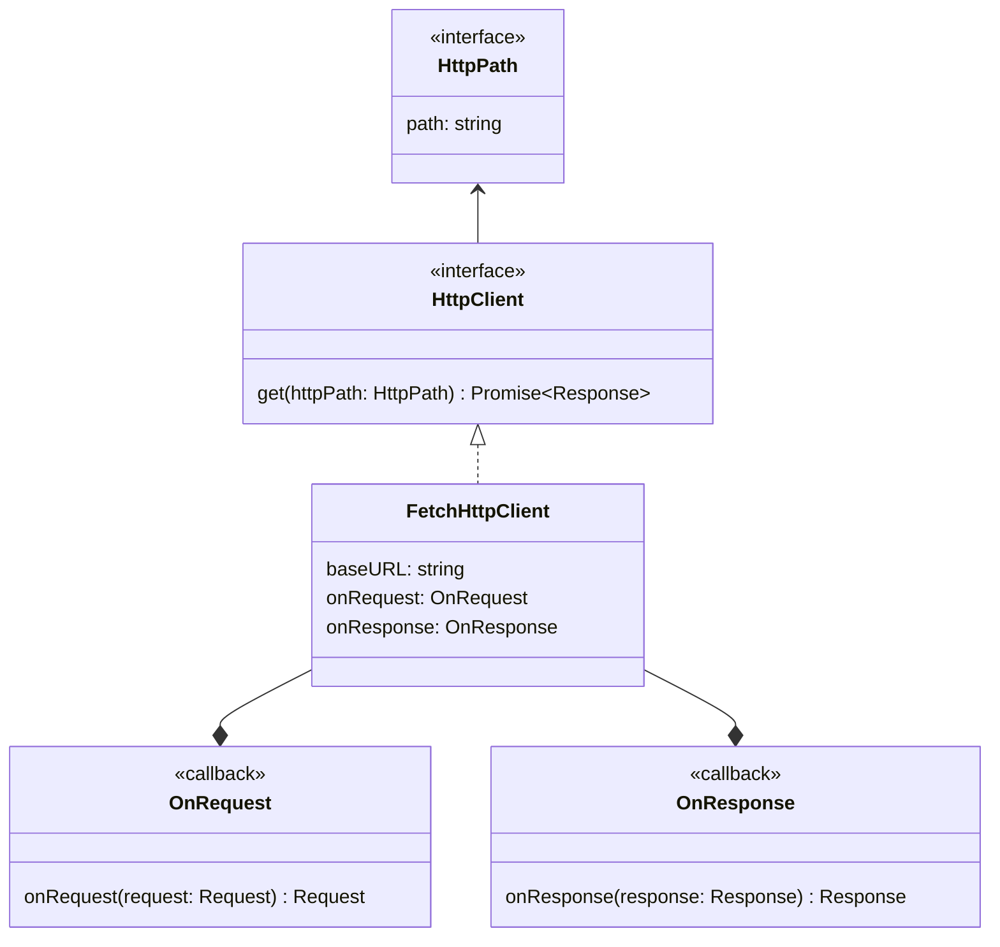

```mermaid
classDiagram
    class FetchHttpClient {
        baseURL: string
        onRequest: OnRequest
        onResponse: OnResponse
    }
    class HttpClient {
        <<interface>>
        get(httpPath: HttpPath) Promise~Response~
    }
    class HttpPath {
        <<interface>>
        path: string
    }
    class OnRequest {
        <<callback>>
        onRequest(request: Request) Request
    }
    class OnResponse{
        <<callback>>
        onResponse(response: Response) Response
    }
    HttpPath <-- HttpClient
    HttpClient <|.. FetchHttpClient
    FetchHttpClient --* OnRequest
    FetchHttpClient --* OnResponse
```
