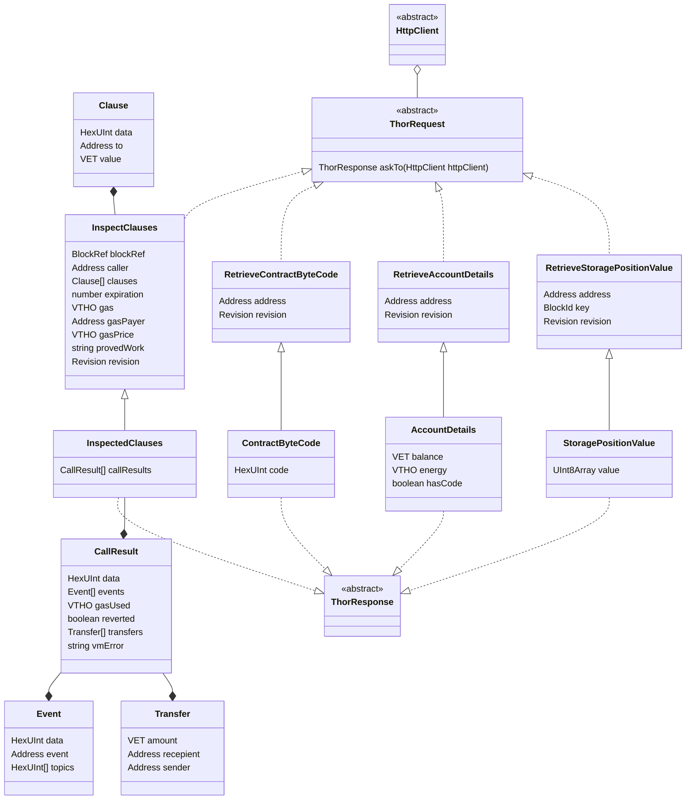

```mermaid
classDiagram
    class AccountDetails {
        VET         balance
        VTHO        energy
        boolean     hasCode
    }
    class CallResult {
        HexUInt     data
        Event[]     events
        VTHO        gasUsed
        boolean     reverted
        Transfer[]  transfers
        string      vmError
    }
    class Clause {
        HexUInt     data
        Address     to
        VET         value
    }
    class InspectedClauses {
        CallResult[] callResults
    }
    class ContractByteCode {
        HexUInt     code
    }
    class Event {
        HexUInt     data
        Address     event
        HexUInt[]   topics
    }
    class InspectClauses {
        BlockRef    blockRef
        Address     caller
        Clause[]    clauses
        number      expiration
        VTHO        gas
        Address     gasPayer
        VTHO        gasPrice
        string      provedWork
        Revision    revision
    }
    class HttpClient {
        <<abstract>>
    }
    class RetrieveContractByteCode {
        Address     address
        Revision    revision
    }
    class RetrieveAccountDetails {
        Address     address
        Revision    revision
    }
    class RetrieveStoragePositionValue {
        Address     address
        BlockId     key
        Revision    revision
    }
    class StoragePositionValue {
        UInt8Array  value
    }
    class ThorRequest {
        <<abstract>>
        ThorResponse askTo(HttpClient httpClient)
    }
    class ThorResponse {
        <<abstract>>
    }
    class Transfer {
        VET         amount
        Address     recepient
        Address     sender
    }
    Clause *-- InspectClauses
    HttpClient o-- ThorRequest
    InspectClauses <|-- InspectedClauses 
    RetrieveContractByteCode <|-- ContractByteCode
    RetrieveAccountDetails <|-- AccountDetails
    RetrieveStoragePositionValue <|-- StoragePositionValue
    ThorRequest <|.. InspectClauses
    ThorRequest <|.. RetrieveContractByteCode
    ThorRequest <|.. RetrieveAccountDetails
    ThorRequest <|.. RetrieveStoragePositionValue
    
    AccountDetails ..|> ThorResponse
    CallResult --* Event
    CallResult --* Transfer
    ContractByteCode ..|> ThorResponse
    InspectedClauses  ..|> ThorResponse
    InspectedClauses --* CallResult
    StoragePositionValue ..|> ThorResponse
```
