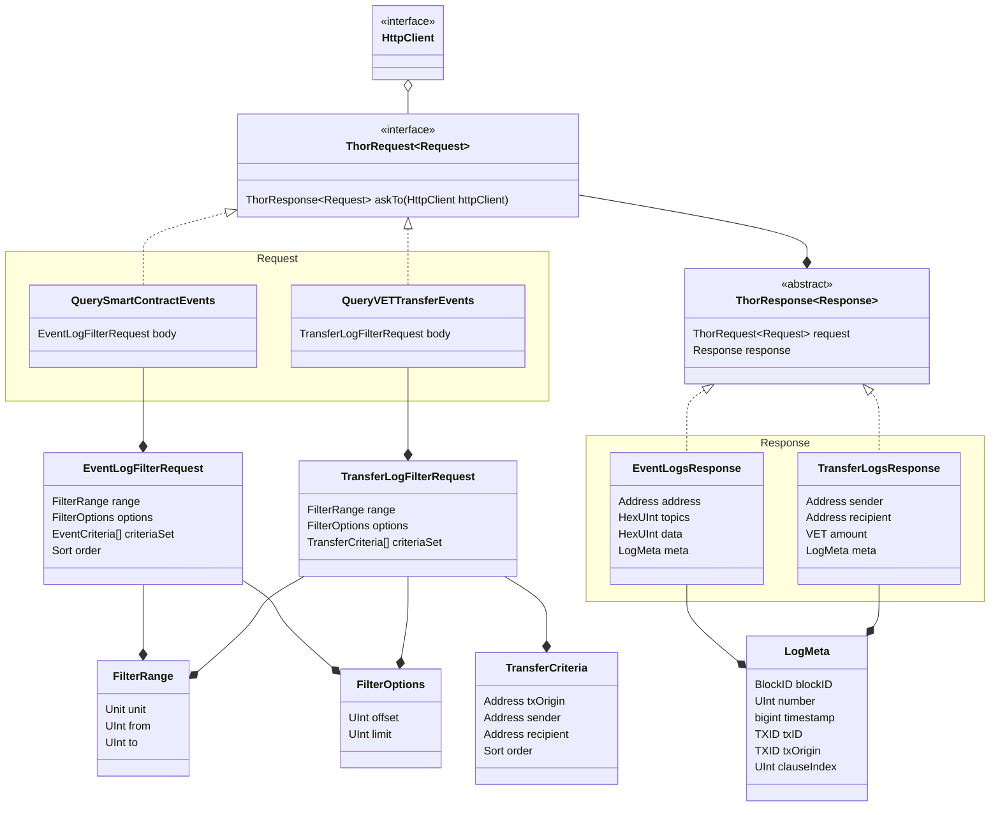

```mermaid
classDiagram
    class HttpClient {
        <<interface>>
    }
    class ThorRequest~Request~ {
        <<interface>>
        ThorResponse~Request~ askTo(HttpClient httpClient)
    }
    class ThorResponse~Response~ {
        <<abstract>>
        ThorRequest~Request~ request
        Response response
    }
    namespace Request {
        class QuerySmartContractEvents {
            EventLogFilterRequest body
        }
        class QueryVETTransferEvents {
            TransferLogFilterRequest body
        }
    }
    namespace Response {
        class EventLogsResponse {
            Address address
            HexUInt topics
            HexUInt data
            LogMeta meta
        }
        class TransferLogsResponse {
            Address sender
            Address recipient
            VET amount
            LogMeta meta
        }
    }
    class EventLogFilterRequest {
        FilterRange range
        FilterOptions options
        EventCriteria[] criteriaSet
        Sort order
    }
    class FilterOptions {
        UInt offset
        UInt limit
    }
    class FilterRange {
        Unit unit
        UInt from
        UInt to
    }
    class LogMeta {
        BlockID blockID
        UInt number
        bigint timestamp
        TXID txID
        TXID txOrigin
        UInt clauseIndex
    }
    class TransferCriteria {
        Address txOrigin
        Address sender
        Address recipient
        Sort order
    }
    class TransferLogFilterRequest {
        FilterRange range
        FilterOptions options
        TransferCriteria[] criteriaSet
    }
    
    HttpClient o-- ThorRequest
    
    ThorRequest <|.. QuerySmartContractEvents
    ThorRequest <|.. QueryVETTransferEvents
    ThorResponse <|.. EventLogsResponse
    ThorResponse <|.. TransferLogsResponse
    
    ThorRequest --* ThorResponse
    EventLogFilterRequest --* FilterRange
    EventLogFilterRequest --* FilterOptions
    EventLogsResponse --* LogMeta
    QuerySmartContractEvents --* EventLogFilterRequest
    QueryVETTransferEvents --* TransferLogFilterRequest
    TransferLogFilterRequest --* FilterOptions
    TransferLogFilterRequest --* FilterRange
    TransferLogFilterRequest --* TransferCriteria
    TransferLogsResponse --* LogMeta
```
