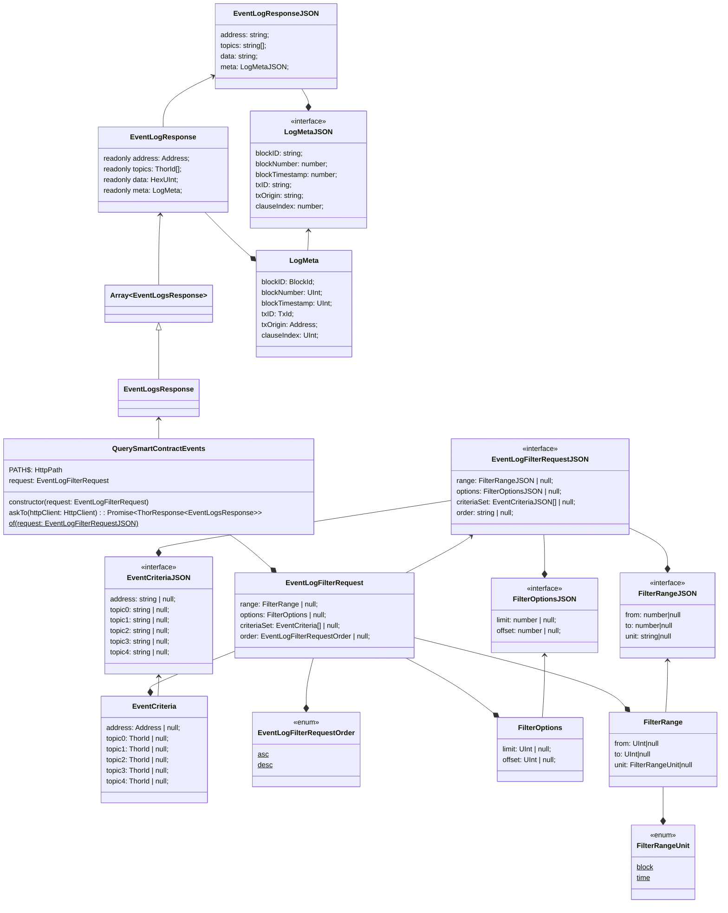

```mermaid
classDiagram
    class Array~EventLogsResponse~ {
    }
    class EventCriteria {
        address: Address | null;
        topic0: ThorId | null;
        topic1: ThorId | null;
        topic2: ThorId | null;
        topic3: ThorId | null;
        topic4: ThorId | null;
    }
    class EventCriteriaJSON {
        <<interface>>
        address: string | null;
        topic0: string | null;
        topic1: string | null;
        topic2: string | null;
        topic3: string | null;
        topic4: string | null;
    }
    class EventLogFilterRequest {
        range: FilterRange | null;
        options: FilterOptions | null;
        criteriaSet: EventCriteria[] | null;
        order: EventLogFilterRequestOrder | null;
    }
    class EventLogFilterRequestJSON {
        <<interface>>
        range: FilterRangeJSON | null;
        options: FilterOptionsJSON | null;
        criteriaSet: EventCriteriaJSON[] | null;
        order: string | null;
    }
    class EventLogFilterRequestOrder {
        <<enum>>
        asc$
        desc$
    }
    class EventLogResponse {
        readonly address: Address;
        readonly topics: ThorId[];
        readonly data: HexUInt;
        readonly meta: LogMeta;
    }
    class EventLogResponseJSON {
        address: string;
        topics: string[];
        data: string;
        meta: LogMetaJSON;
    }
    class EventLogsResponse {
    }
    class FilterOptions {
        limit: UInt | null;
        offset: UInt | null;
    }
    class FilterOptionsJSON {
        <<interface>>
        limit: number | null;
        offset: number | null;
    }
    class FilterRange {
        from: UInt|null
        to: UInt|null
        unit: FilterRangeUnit|null
    }
    class FilterRangeJSON {
        <<interface>>
        from: number|null
        to: number|null
        unit: string|null
    }
    class FilterRangeUnit {
        <<enum>>
        block$
        time$
    }
    class LogMeta {
        blockID: BlockId;
        blockNumber: UInt;
        blockTimestamp: UInt;
        txID: TxId;
        txOrigin: Address;
        clauseIndex: UInt;
    }
    class LogMetaJSON {
        <<interface>>
        blockID: string;
        blockNumber: number;
        blockTimestamp: number;
        txID: string;
        txOrigin: string;
        clauseIndex: number;
    }
    class QuerySmartContractEvents {
        PATH$: HttpPath
        request: EventLogFilterRequest
        constructor(request: EventLogFilterRequest)
        askTo(httpClient: HttpClient): Promise~ThorResponse~EventLogsResponse~~
        of(request: EventLogFilterRequestJSON)$
    }
    Array~EventLogResponse~ <|-- EventLogsResponse
    EventCriteriaJSON <-- EventCriteria
    EventLogFilterRequestJSON <-- EventLogFilterRequest
    EventLogResponse <-- Array~EventLogResponse~ 
    EventLogResponseJSON <-- EventLogResponse
    EventLogsResponse <-- QuerySmartContractEvents
    FilterOptionsJSON <-- FilterOptions
    FilterRangeJSON <-- FilterRange
    LogMetaJSON <-- LogMeta
    EventLogFilterRequest --* FilterRange
    EventLogFilterRequest --* FilterOptions
    EventLogFilterRequest --* EventCriteria
    EventLogFilterRequest --* EventLogFilterRequestOrder
    EventLogFilterRequestJSON --* FilterRangeJSON
    EventLogFilterRequestJSON --* FilterOptionsJSON
    EventLogFilterRequestJSON --* EventCriteriaJSON
    EventLogResponse --* LogMeta
    EventLogResponseJSON --* LogMetaJSON
    FilterRange --* FilterRangeUnit
    QuerySmartContractEvents --* EventLogFilterRequest
```
