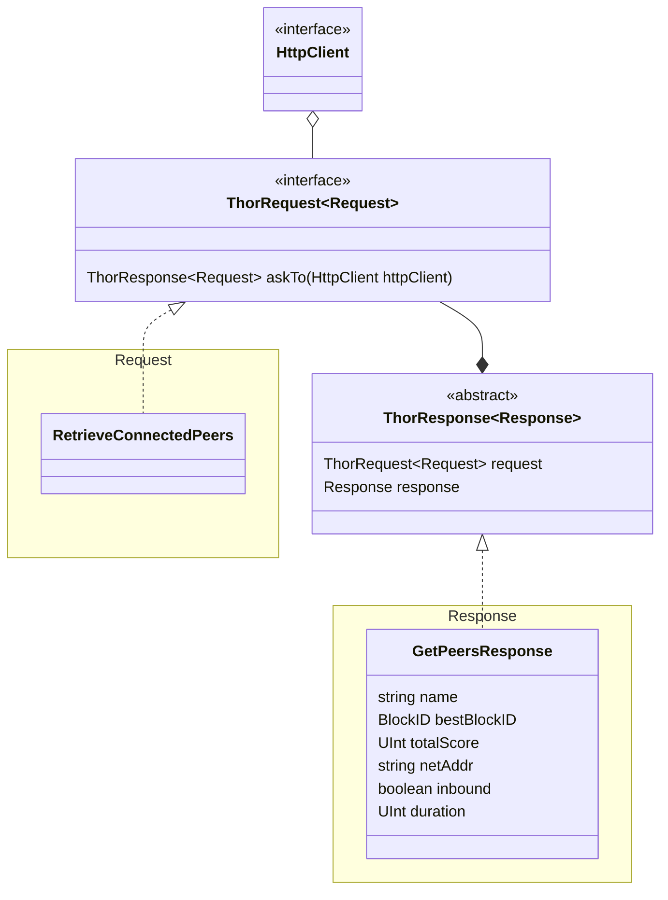

```mermaid
classDiagram
    class HttpClient {
        <<interface>>
    }
    class ThorRequest~Request~ {
        <<interface>>
        ThorResponse~Request~ askTo(HttpClient httpClient)
    }
    class ThorResponse~Response~ {
        <<abstract>>
        ThorRequest~Request~ request
        Response response
    }
    namespace Request {
        class RetrieveConnectedPeers {
        }
    }
    namespace Response {
        class GetPeersResponse {
            string name
            BlockID bestBlockID
            UInt totalScore
            string netAddr
            boolean inbound
            UInt duration
        }
    }
    
    HttpClient o-- ThorRequest
    
    ThorRequest <|.. RetrieveConnectedPeers
    ThorResponse <|.. GetPeersResponse
    
    ThorRequest --* ThorResponse
```
