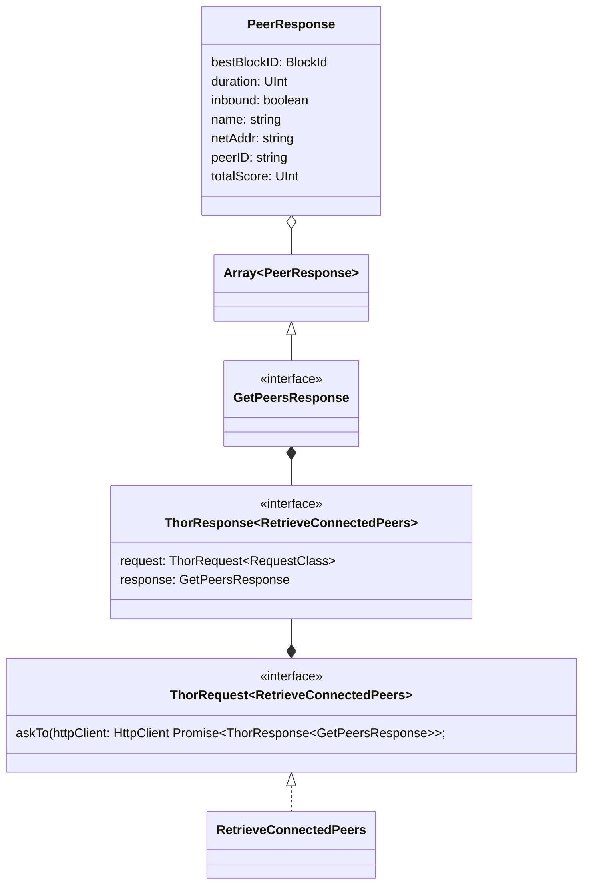

```mermaid
classDiagram
    class Array~PeerResponse~ {
    }
    class GetPeersResponse{
        <<interface>>
    }
    class PeerResponse {
        bestBlockID: BlockId
        duration: UInt
        inbound: boolean
        name: string
        netAddr: string
        peerID: string
        totalScore: UInt
        
    }
    class RetrieveConnectedPeers {
        
    }
    class ThorRequest~RetrieveConnectedPeers~ {
        <<interface>>
        askTo(httpClient: HttpClient Promise~ThorResponse~GetPeersResponse~~;
    }
    class ThorResponse~RetrieveConnectedPeers~ {
        <<interface>>
        request: ThorRequest~RequestClass~
        response: GetPeersResponse
    }
    Array~PeerResponse~ <|-- GetPeersResponse
    PeerResponse o-- Array~PeerResponse~
    ThorRequest~RetrieveConnectedPeers~ <|.. RetrieveConnectedPeers
    GetPeersResponse *-- ThorResponse~RetrieveConnectedPeers~
    ThorResponse~RetrieveConnectedPeers~ --* ThorRequest
```
