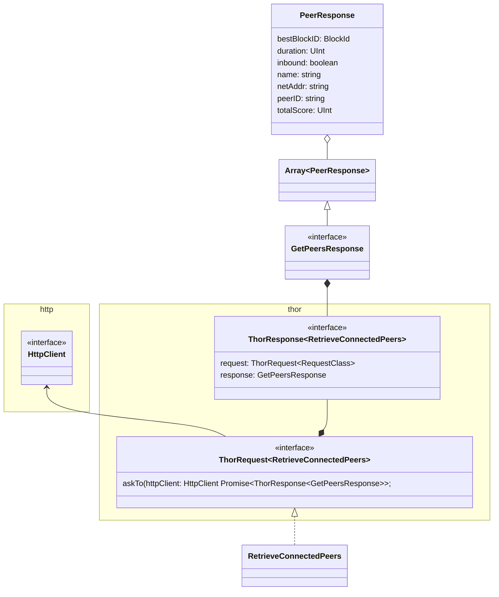

```mermaid
classDiagram
    class Array~PeerResponse~ {
    }
    class GetPeersResponse {
        <<interface>>
    }
    class PeerResponse {
        bestBlockID: BlockId
        duration: UInt
        inbound: boolean
        name: string
        netAddr: string
        peerID: string
        totalScore: UInt
    }
    class RetrieveConnectedPeers {
    }
    namespace http {
        class HttpClient {
            <<interface>>
        }
    }
    namespace thor {
        class ThorRequest~RetrieveConnectedPeers~ {
            <<interface>>
            askTo(httpClient: HttpClient Promise~ThorResponse~GetPeersResponse~~;
        }
        class ThorResponse~RetrieveConnectedPeers~ {
            <<interface>>
            request: ThorRequest~RequestClass~
            response: GetPeersResponse
        }
    }
    Array~PeerResponse~ <|-- GetPeersResponse
    GetPeersResponse *-- ThorResponse~RetrieveConnectedPeers~
    HttpClient <-- ThorRequest~RetrieveConnectedPeers~
    PeerResponse o-- Array~PeerResponse~
    ThorRequest~RetrieveConnectedPeers~ <|.. RetrieveConnectedPeers
    ThorResponse~RetrieveConnectedPeers~ --* ThorRequest~RetrieveConnectedPeers~
```
