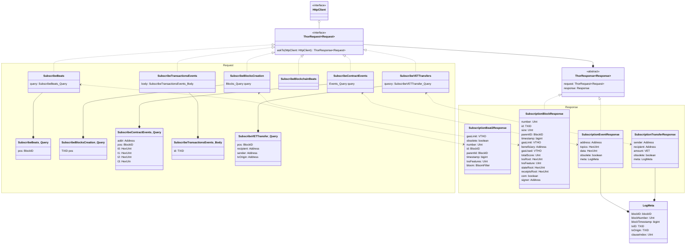

```mermaid
classDiagram
    class HttpClient {
        <<interface>>
    }
    class ThorRequest~Request~ {
        <<interface>>
        askTo(httpClient: HttpClient) ThorResponse~Request~
    }
    class ThorResponse~Response~ {
        <<abstract>>
        request: ThorRequest~Request~
        response: Response
    }
    namespace Request {
        class SubscribeBeats {
            query: SubscribeBeats_Query 
        }
        class SubscribeBeats_Query {
            pos: BlockID
        }
        class SubscribeBlocksCreation {
            Blocks_Query query
        }
        class SubscribeBlocksCreation_Query {
            TXID pos
        }
        class SubscribeContractEvents {
            Events_Query query
        }
        class SubscribeContractEvents_Query {
            addr: Address
            pos: BlockID
            t0: HexUInt
            t1: HexUInt
            t2: HexUInt
            t3: HexUIn
        }
        class SubscribeBlockchainBeats {
        }
        class SubscribeTransactionsEvents {
            body: SubscribeTransactionsEvents_Body 
        }
        class SubscribeTransactionsEvents_Body {
            id: TXID
        }
        class SubscribeVETTransfers {
            quesry: SubscribeVETTransfer_Query 
        }
        class SubscribeVETTransfer_Query {
            pos: BlockID
            recipient: Address
            sender: Address
            txOrigin: Address
        }
    }
    namespace Response {
        class SubscriptionBeat2Response {
            gasLimit: VTHO
            obsolete: boolean
            number: UInt
            id: BlockID
            parentId: BlockID
            timestamp: bigint
            txsFeatures: UInt
            bloom: BloomFilter
        }
        class SubscriptionBlockResponse {
            number: UInt
            id: TXID
            size: UInt
            parentID: BlockID
            timestamp: bigint
            gasLimit: VTHO
            beneficiary: Address
            gasUsed: VTHO
            totalScore: UInt
            txsRoot: HexUInt
            txsFeature: UInt
            stateRoot: HexUInt
            receiptsRoot: HexUInt
            com: boolean
            signer: Address
        }
        class SubscriptionEventResponse {
            address: Address
            topics: HexUInt
            data: HexUInt
            obsolete: boolean
            meta: LogMeta
        }
        class SubscriptionTransferResponse {
            sender: Address
            recipient: Address
            amount: VET
            obsolete: boolean
            meta: LogMeta
        }
    }
    class LogMeta {
        blockID: blockID
        blockNumber: UInt
        blockTimestamp: bigint
        txID: TXID
        txOrigin: TXID
        clauseIndex: UInt
    }

    HttpClient o-- ThorRequest
    ThorRequest <|.. SubscribeBeats
    ThorRequest <|.. SubscribeBlocksCreation
    ThorRequest <|.. SubscribeContractEvents
    ThorRequest <|.. SubscribeBlockchainBeats
    ThorRequest <|.. SubscribeTransactionsEvents
    ThorRequest <|.. SubscribeVETTransfers
    ThorResponse <|.. SubscriptionBlockResponse
    ThorResponse <|.. SubscriptionEventResponse
    ThorRequest --* ThorResponse
    SubscribeBeats --* SubscribeBeats_Query
    SubscribeBlocksCreation --* SubscribeBlocksCreation_Query
    SubscribeContractEvents --* SubscribeContractEvents_Query
    SubscribeTransactionsEvents --* SubscribeTransactionsEvents_Body 
    SubscriptionEventResponse --* LogMeta
    SubscriptionTransferResponse --*LogMeta
    SubscribeVETTransfers --* SubscribeVETTransfer_Query
    SubscribeBeats <..> SubscriptionBeat2Response
    SubscribeBlocksCreation <..> SubscriptionBlockResponse
    SubscribeContractEvents <..> SubscriptionEventResponse
    SubscribeVETTransfers <..> SubscriptionTransferResponse
```
