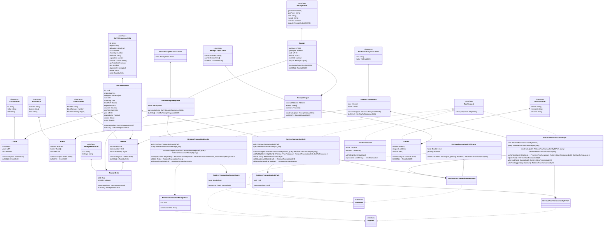

```mermaid
classDiagram
    class Clause {
        to: Address
        value: VET
        data: HexUInt
        constructor(json: EventJSON)
        toJSON() EventJSON
    }
    class ClauseJSON {
        <<interface>>
        to: string
        value: string
        data string
    }
    class Event {
        address: Address
        topics: ThorId[]
        data HexUInt
        constructor(json: EventJSON)
        toJSON() EventJSON
    }
    class EventJSON {
        <<interface>>
        address: string
        topics: string[]
        data: string
    }
    class GetRawTxResponse {
        raw: HexUInt
        meta: TxMeta
        constructor(json: GetTawTxResponseJSON)
        toJSON() GetTawTxResponseJSON
    }
    class GetRawTxResponseJSON {
        <<interface>>
        raw: string;
        meta: TxMetaJSON
    }
    class GetTxReceiptResponse {
        meta: ReceiptMeta
        constructor(json: GetTxReceiptResponseJSON)
        toJSON(): GetTxReceiptResponseJSON
    }
    class GetTxReceiptResponseJSON {
        meta: ReceiptMetaJSON
    }
    class GetTxResponse {
        id: TxId
        origin: Address
        delegator: Address|null
        size: UInt
        chainTag: UInt
        blockRef: BlockId
        expiration: UInt
        clauses: Clause[]
        gasPriceCoef: UInt
        gas: VTHO
        dependsOn: TxId|null
        nonce: Nonce
        meta: TxMeta
        constructor(json: GetTxResponseJSON)
        toJSON() GetTxResponseJSON
    }
    class GetTxResponseJSON {
        <<interface>>
        id: string
        origin: string
        delegator: string|null
        size: number
        chainTag: number
        blockRef: string
        expiration: number
        clauses: ClauseJSON[]
        gasPriceCoef: number
        gas: number
        dependsOn: string|null
        nonce: string
        meta: TxMetaJSON
    }
    class Receipt {
        gasUsed: VTHO
        gasPayer: Address
        paid: VTHO
        reward: VTHO
        reverted: boolean
        outputs: ReceiptOutput[]
        constructor(json: ReceiptJSON)
        toJSON() ReceiptJSON
    }
    class ReceiptJSON {
        <<interface>>
        gasUsed: number;
        gasPayer: string;
        paid: string;
        reward: string;
        reverted: boolean;
        outputs: ReceiptOutputJSON[];
    }
    class ReceiptMeta {
        txID: TxId
        txOrigin: Address
        constructor(json: ReceiptMetaJSON)
        toJSON() ReceiptMetaJSON
    }
    class ReceiptMetaJSON {
        <<interface>>
        txID: string
        txOrigin: string
    }
    class ReceiptOutput {
        contractAddress: Address
        events: Event[]
        transfers: Transfer[]
        constructor(json: ReceiptOutputJSON)
        toJSON(): ReceiptOutputJSON
    }
    class ReceiptOutputJSON {
        <<interface>>
        contractAddress: string
        events: EventJSON[]
        transfers: TransferJSON[]
    }
    class RetrieveRawTransactionByID {
        path: RetrieveRawTransactionByIDPath;
        query: RetrieveRawTransactionByIDQuery;
        constructor(path: RetrieveRawTransactionByIDPath, query: RetrieveRawTransactionByIDQuery)
        askTo(httpClient: HttpClient): Promise~ThorResponse~ RetrieveRawTransactionByID, GetRawTxResponse~~
        of(txId: TxId) RetrieveRawTransactionByID
        withHead(head: BlockId|null) RetrieveRawTransactionByID
        withPending(pending: boolean) RetrieveRawTransactionByID
    }
    class RetrieveRawTransactionByIDPath {
    }
    class RetrieveRawTransactionByIDQuery {
    }
    class RetrieveTransactionByID {
        path: RetrieveTransactionByIDPath
        query: RetrieveTransactionByIDQuery
        constructor(path: RetrieveTransactionByIDPath, query: RetrieveTransactionByIDQuery)
        askTo(httpClient: HttpClient) Promise~ThorResponse~ RetrieveTransactionByID, GetTxResponse~~
        of(txId: TxId) RetrieveTransactionByID
        withHead(head: BlockId|null): RetrieveTransactionByID
        withPending(pending: boolean): RetrieveTransactionByID
    }
    class RetrieveTransactionByIDPath {
        txId: TxId
        constructor(txId: TxId)
    }
    class RetrieveTransactionByIDQuery {
        head: BlockId | null;
        pending: boolean
        constructor(head: BlockId|null, pending: boolean) RetrieveTransactionByIDQuery
    }
    class RetrieveTransactionReceipt {
        path: RetrieveTransactionReceiptPath
        query: RetrieveTransactionReceiptQuery
        constructor(path: RetrieveTransactionReceiptPath, query: RetrieveTransactionReceiptQuery)
        askTo(httpClient: HttpClient): Promise~ThorResponse~ RetrieveTransactionReceipt, GetTxReceiptResponse~~
        of(txId: TxId): RetrieveTransactionReceipt
        withHead(head: BlockId): RetrieveTransactionReceipt
    }
    class RetrieveTransactionReceiptPath {
        txId: TxId
        constructor(txId: TxId)
    }
    class RetrieveTransactionReceiptQuery {
        head: BlockId|null;
        constructor(head: BlockId|null)
    }
    class SendTransaction {
        PATH: HttpPath
        encoded: Uint8Array
        askTo(httpClient: httpClient)
        of(encoded: Uint8Array): SendTransaction
    }
    class Transfer {
        sender: Address;
        recipient: Address;
        amount: VET;
        constructor(json: TransferJSON)
        toJSON(): TransferJSON
    }
    class TransferJSON {
        <<interface>>
        sender: string;
        recipient: string;
        amount: string;
    }
    class TxMeta {
        blockID: BlockId;
        blockNumber: UInt;
        blockTimestamp: bigint;
        constructor(json: TxMetaJSON)
        toJSON(): TxMetaJSON
    }
    class TxMetaJSON {
        <<interface>>
        blockID: string;
        blockNumber: number;
        blockTimestamp: bigint;
    }
    class ThorRequest {
        <<interface>>
        askTo: (httpClient: HttpClient)
    }
    class HttpPath {
        <<interface>>
    }
    class HttpQuery {
        <<interface>>
    }
    RetrieveRawTransactionByIDPath ..|> HttpPath
    RetrieveTransactionByIDPath ..|> HttpPath
    RetrieveTransactionReceiptPath ..|> HttpPath
    RetrieveRawTransactionByIDQuery ..|> HttpQuery
    RetrieveTransactionByIDQuery ..|> HttpQuery
    RetrieveTransactionReceiptQuery ..|> HttpQuery
    ThorRequest <|.. RetrieveRawTransactionByID
    ThorRequest <|.. RetrieveTransactionByID
    ThorRequest <|.. RetrieveTransactionReceipt
    ThorRequest <|.. SendTransaction
    Receipt <|-- GetTxReceiptResponse
    RetrieveTransactionByIDPath <|-- RetrieveRawTransactionByIDPath
    RetrieveTransactionByIDQuery <|-- RetrieveRawTransactionByIDQuery
    TxMeta <-- ReceiptMeta
    RetrieveRawTransactionByID --* RetrieveRawTransactionByIDPath
    RetrieveRawTransactionByID --* RetrieveRawTransactionByIDQuery
    RetrieveTransactionByID --* RetrieveTransactionByIDPath
    RetrieveTransactionByID --* RetrieveRawTransactionByIDQuery
    RetrieveTransactionReceipt --* RetrieveTransactionReceiptPath
    RetrieveTransactionReceipt --* RetrieveTransactionReceiptQuery
    GetRawTxResponse --* TxMeta
    GetTxReceiptResponse --* ReceiptMeta
    GetTxResponse --* Clause
    GetTxResponse --* TxMeta
    Receipt --* ReceiptOutput
    ReceiptOutput --* Event
    ReceiptOutput --* Transfer
    ClauseJSON <-- Clause
    EventJSON <-- Event
    GetRawTxResponseJSON <-- GetRawTxResponse
    GetTxReceiptResponseJSON <-- GetTxReceiptResponse
    GetTxResponseJSON <-- GetTxResponse
    ReceiptJSON <-- Receipt
    ReceiptMetaJSON <-- ReceiptMeta
    ReceiptOutputJSON <-- ReceiptOutput
    TransferJSON <-- Transfer
    TxMetaJSON <-- TxMeta
    GetRawTxResponse <-- RetrieveRawTransactionByID
    GetTxResponse <-- RetrieveTransactionByID
    GetTxReceiptResponse <-- RetrieveTransactionReceipt
```
