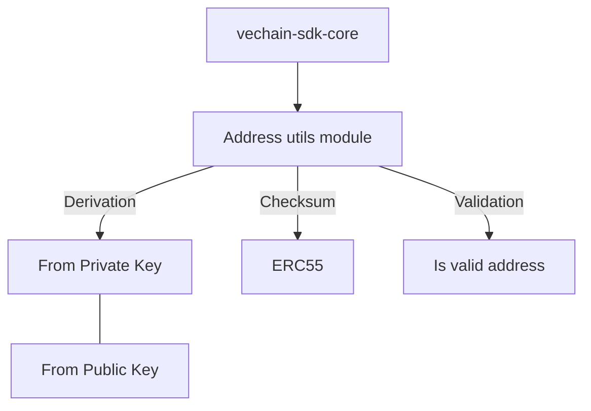

# Address utils

This module handles all address related operations:

* Address derivation (from the private and public key)
* Address checking
* Address ERC55 Checksum

# Diagram

# Example

## Address Derivation

Here we have a simple example of address derivation:
[AddressDerivationSnippet](examples/address-utils/address-derivation.ts)

## Address Validation

Here we have a simple example of address validation:
[AddressValidationSnippet](examples/address-utils/address-validation.ts)

## Address Checksum

Here we have a simple example of address ERC55 checksum:
[AddressERC55ChecksumSnippet](examples/address-utils/address-erc55-checksum.ts)
